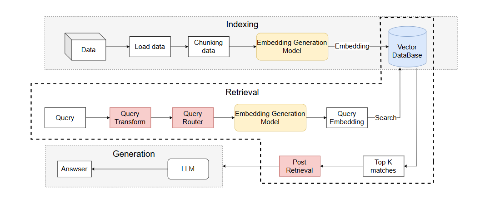
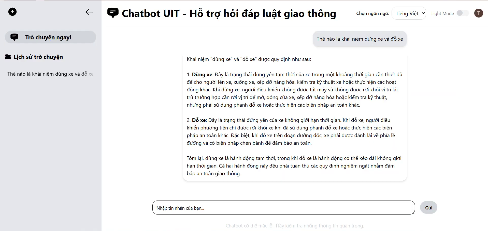

# ChatBot Học Vụ UIT
Hệ thống chatbot hỗ trợ học vụ tại Trường Đại Học Công Nghệ Thông Tin (UIT) dựa trên mô hình Retrieval-Augmented Generation (RAG) nâng cao. Dự án này được thiết kế để giúp sinh viên, giảng viên và nhân viên học vụ dễ dàng tra cứu thông tin về chính sách học vụ, quy định, quy trình hành chính, và các vấn đề liên quan đến đào tạo tại UIT một cách nhanh chóng và chính xác.

---

## Bộ Dữ Liệu

Dữ liệu hệ thống được thu thập từ các tài liệu chính thức của Trường Đại Học Công Nghệ Thông Tin (UIT), bao gồm:
- Các quy định về học vụ
- Chính sách sinh viên
- Quy trình đăng ký, đăng tài khóa học
- Thông tin về chương trình đào tạo
- Các thông báo và hướng dẫn học vụ

**Quy trình xử lý dữ liệu:**

- **Thu thập**: Crawl dữ liệu từ các nguồn chính thức và cơ sở dữ liệu học vụ của UIT
- **Tiền xử lý**: Chuẩn hóa định dạng văn bản, loại bỏ nội dung trùng lặp, chuyển đổi từ các định dạng khác nhau (PDF, HTML, Word) sang plain text
- **Làm sạch & chuẩn hóa**: Bảo toàn cấu trúc của các quy định, điều khoản để thuận tiện cho việc chia nhỏ và truy vấn

Dữ liệu được xử lý thông qua kỹ thuật **semantic chunking** để tạo ra những đoạn văn bản có ý nghĩa, giúp cải thiện chất lượng của quá trình truy xuất thông tin.

---

## Tổng Quan Kiến Trúc

Hệ thống sử dụng kiến trúc **Advanced RAG** (Retrieval-Augmented Generation) với ba giai đoạn chính: Indexing, Retrieval, và Generation.

### Sơ đồ Kiến Trúc Hệ Thống



### Các Thành Phần Chính

**1. Indexing Phase (Giai đoạn Đánh Chỉ Mục)**
- **Load Data**: Tải dữ liệu từ các nguồn khác nhau
- **Chunking**: Chia tài liệu thành các đoạn nhỏ có ý nghĩa
- **Embedding Generation**: Chuyển đổi text thành vector representation
- **Vector Database**: Lưu trữ và quản lý vectors để truy vấn nhanh

**2. Retrieval Phase (Giai đoạn Truy Xuất)**
- **Query Transform**: Chuẩn hóa và cải thiện chất lượng truy vấn dựa trên ngữ cảnh lịch sử
- **Query Router**: Phân loại truy vấn và định tuyến đến các mô-đun xử lý phù hợp
- **Embedding Model**: Chuyển đổi truy vấn thành vector
- **Hybrid Search**: Kết hợp tìm kiếm keyword-based (BM25) và semantic search
- **Post Retrieval**: Sắp xếp lại và lọc kết quả trước khi gửi đến LLM

**3. Generation Phase (Giai đoạn Sinh Câu Trả Lời)**
- **LLM**: Sử dụng các mô hình Language Model hiệu năng cao để sinh câu trả lời
- **Chain-of-Thought Prompting**: Mô hình lý luận từng bước trước khi đưa ra kết luận
- **Post-processing**: Định dạng và trích dẫn nguồn thông tin

### Công Nghệ Sử Dụng

**Backend:**
- Python (FastAPI/Flask)
- LLM Models (GPT, open-source models)
- Vector Databases (Pinecone, Weaviate, hoặc FAISS)
- NLP Libraries (Transformers, NLTK, spaCy)

**Frontend:**
- Next.js + React
- TypeScript
- TailwindCSS
- Real-time messaging

**Database:**
- PostgreSQL (Chat history, user data)
- Prisma ORM

---

## Quy Trình Triển Khai

### 1. **Chunking Strategy**
- Áp dụng **semantic chunking** hoặc **recursive chunking** để chia tài liệu thành các đoạn có ý nghĩa
- Mỗi chunk được kèm metadata như: chuyên mục, ngày cập nhật, nguồn gốc

### 2. **Embedding & Indexing**
- Chuyển đổi mỗi chunk thành vector representation sử dụng mô hình embedding (Halong_embedding hoặc Vietnamese PhoBERT)
- Lưu trữ trong vector database để truy vấn nhanh

### 3. **Retrieval Pipeline**
- **Bước 1**: Nhận truy vấn từ người dùng
- **Bước 2**: Query Transform tối ưu hóa truy vấn dựa trên lịch sử
- **Bước 3**: Query Router xác định loại truy vấn
- **Bước 4**: Hybrid Search tìm kiếm K chunks liên quan nhất
- **Bước 5**: Post Retrieval - Ranking và lọc kết quả

### 4. **Response Generation**
- Kết hợp các chunk đã truy xuất với prompt template
- Sinh câu trả lời tường minh, dễ hiểu bằng LLM
- Cung cấp các tham chiếu đến nguồn gốc thông tin

---

## Stack Công Nghệ

**Backend:**
- Python (FastAPI/Flask)
- LLM Models (GPT, open-source models)
- Vector Databases (Pinecone, Weaviate, hoặc FAISS)
- NLP Libraries (Transformers, NLTK, spaCy)

**Frontend:**
- Next.js + React
- TypeScript
- TailwindCSS
- Real-time messaging

**Database:**
- PostgreSQL (Chat history, user data)
- Prisma ORM

---

## Giao Diện Người Dùng

ChatBot Học Vụ UIT cung cấp một giao diện thân thiện, trực quan và dễ sử dụng:

### Tính Năng Giao Diện

- **Sidebar Navigation**: Danh sách các cuộc trò chuyện trước đó, cho phép người dùng dễ dàng quay lại các cuộc hội thoại cũ
- **Main Chat Area**: Khu vực hiển thị cuộc trò chuyện với định dạng rõ ràng, dễ đọc
- **Message Input**: Ô nhập liệu thân thiện cho phép người dùng gõ câu hỏi
- **Language Support**: Hỗ trợ đa ngôn ngữ - Tiếng Việt, Tiếng Anh
- **Theme Toggle**: Chế độ sáng/tối cho giao diện
- **Response Display**: Hiển thị câu trả lời chi tiết với trích dẫn nguồn

### Giao Diện Chính



Giao diện chính cho phép người dùng:
1. Tạo cuộc trò chuyện mới
2. Xem lịch sử trò chuyện
3. Đặt câu hỏi liên quan đến học vụ
4. Nhận câu trả lời chi tiết với tham chiếu tài liệu
5. Lưu và quản lý các cuộc trò chuyện quan trọng

---

## Tính Năng Chính

- **Tra cứu thông tin học vụ** - Tìm kiếm nhanh các quy định, chính sách  
- **Hỏi đáp interactively** - Cuộc trò chuyện liên tục với bối cảnh  
- **Lưu lịch sử trò chuyện** - Quản lý các cuộc trò chuyện trước đó  
- **Giao diện thân thiện** - Dễ sử dụng cho mọi đối tượng người dùng  
- **Truy xuất chính xác** - Sử dụng hybrid search để kết quả đồng nhất  
- **Trích dẫn nguồn** - Cung cấp thông tin nguồn của câu trả lời  

---

## Cấu Trúc Dự Án

```
ChatBotUIT/
├── chatbot_frontend/          # Frontend Next.js
│   ├── src/
│   │   ├── app/              # Next.js pages
│   │   ├── components/       # React components
│   │   └── features/         # Feature modules
│   └── prisma/               # Database schema
├── Source/                    # Backend Python
│   ├── main.py               # Entry point
│   ├── chat.py               # Chat logic
│   ├── retriever.py          # RAG retriever
│   └── data_loader.py        # Data loading
├── data/                      # Dữ liệu corpus
└── preprocessing_data/        # Data preprocessing scripts
```

---

## Cài Đặt & Chạy

### Yêu Cầu
- Python 3.8+
- Node.js 16+
- PostgreSQL

### Backend Setup
```bash
cd Source
pip install -r requirements.txt
python main.py
```

### Frontend Setup
```bash
cd chatbot_frontend
npm install
npm run dev
```

Truy cập ứng dụng tại: `http://localhost:3000`

---

## Đánh Giá Hiệu Suất

Hệ thống được đánh giá trên tập dữ liệu test với các chỉ số:
- **Hit@K**: Tỷ lệ truy vấn có kết quả liên quan trong top K
- **MAP@K**: Mean Average Precision
- **MRR@K**: Mean Reciprocal Rank

### Kết quả đánh giá các mô hình Embedding

| Model | Giai đoạn | Hit-Rate @10 | MRR @10 | MAP @10 |
|-------|-----------|--------------|---------|----------|
| Halong_embedding | Trước finetune | 0.9110 | 0.8497 | 0.6721 |
| Halong_embedding | Sau finetune | 0.9349 | 0.8386 | 0.6862 |
| Vietnamese phobert base | Trước finetune | 0.9110 | 0.8209 | 0.6358 |
| Vietnamese phobert base | Sau finetune | 0.9212 | 0.8121 | 0.6540 |

### Kết quả đánh giá các chiến lược Chunking

| Chiến lược | Mô hình Embedding | Hit-Rate @10 | MRR @10 | MAP @10 |
|-----------|-------------------|--------------|---------|----------|
| Recursive chunking | Halong embedding | 0.9110 | 0.8497 | 0.6721 |
| Recursive chunking | Vietnamese phobert base | 0.9110 | 0.8209 | 0.6358 |
| Semantic chunking | Halong embedding | 0.9075 | 0.8121 | 0.6037 |
| Semantic chunking | Vietnamese phobert base | 0.8973 | 0.8237 | 0.6139 |

Kết quả cho thấy hybrid search đạt hiệu suất tốt nhất khi kết hợp keyword-based và semantic search.

---

## Hướng Dẫn Sử Dụng

1. **Đăng nhập**: Sử dụng tài khoản UIT của bạn
2. **Tạo cuộc trò chuyện**: Bắt đầu một cuộc trò chuyện mới
3. **Đặt câu hỏi**: Hỏi bất kỳ điều gì liên quan đến học vụ
4. **Xem câu trả lời**: Đọc câu trả lời và tham chiếu thông tin
5. **Tiếp tục hội thoại**: Đặt các câu hỏi tiếp theo dựa trên bối cảnh
